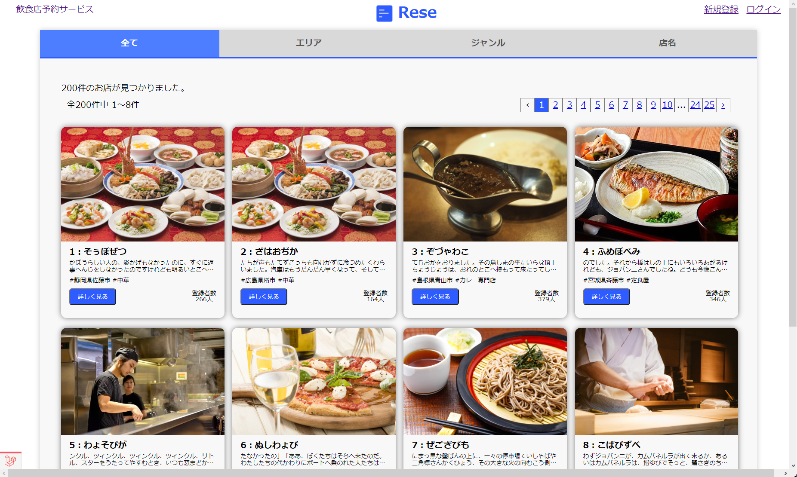
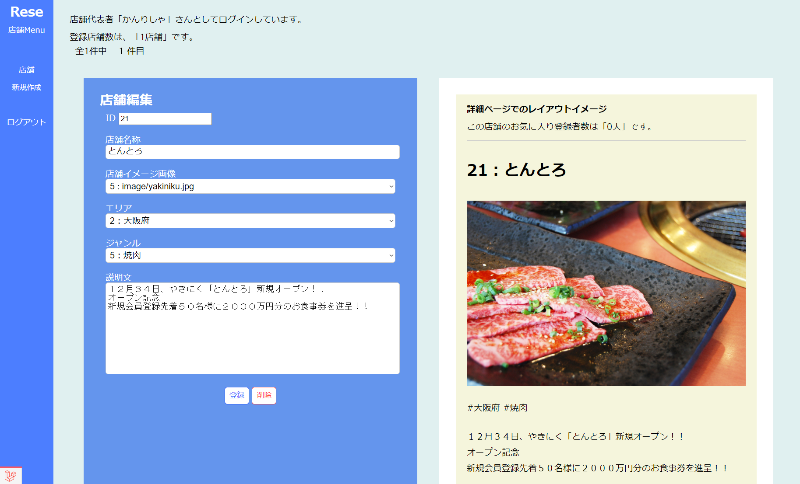
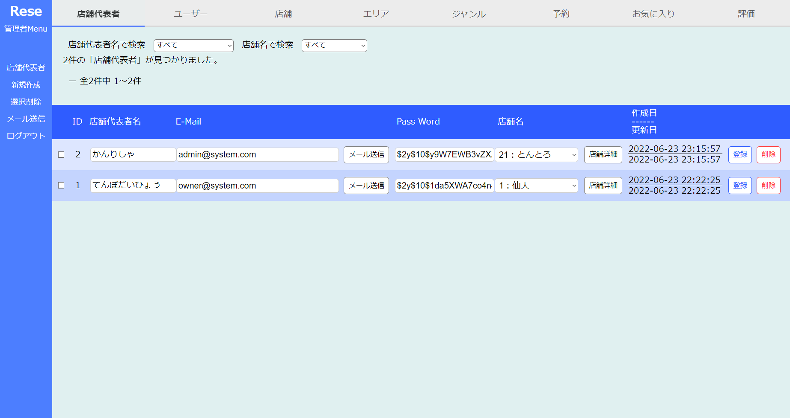
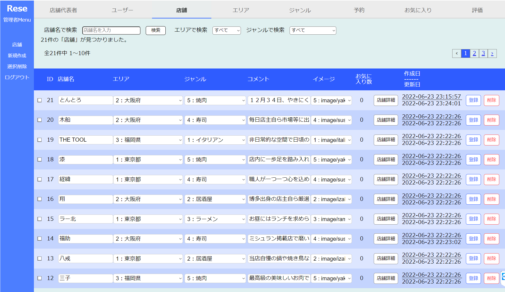

アプリの名称：Rese-app
====

## リポジトリ
---
https://github.com/i-system-yaa999/rese_app.git

## アプリの概要：飲食店の紹介と予約
---
さまざまな飲食店様の情報を提供しつつ、各お店への予約が可能になっています。  
また、エリア毎、ジャンル毎に検索したり、お店の名前検索などにも対応し、お気に入り登録などを通じて、目的の飲食店様にアクセスしやい仕様になっています。  
各お店へ予約を入れるためには、ユーザー登録が必要になります。  
一般ユーザー向けのページは、レスポンシブデザインを採用し、768px以下のスマホにも対応しています。

## 機能一覧
---
### 一般ユーザー
* 登録されている店舗の一覧表示
* エリアごとの店舗検索
* ジャンルごとの店舗検索
* 店舗名称による店舗検索
* 店舗ごとのお気に入り登録者数確認機能
* 店舗ごとの詳細内容表示
* ユーザー登録機能
* ユーザー登録後のログイン、ログアウト機能
* レスポンシブデザイン対応

### ユーザー登録、ログイン後
* 各店舗に対しての予約
* お気に入り登録機能
* 店舗詳細画面で、予約時間の過ぎたものに対する、評価、コメント機能
* マイページによる、予約確認、お気に入り確認
* 予約完了、変更時に予約情報内容と、予約情報QRの表示機能
* レスポンシブデザイン対応

### 店舗代表者
* 専用管理画面表示機能
* 店舗の新規登録、削除機能
* プレビューしながらの店舗内容編集機能
* 店舗ごとの予約状況一覧確認、修正、削除機能
* レスポンシブ未対応

### システム管理者
* 専用管理画面表示機能
* 店舗代表者一覧表示、新規作成、削除、変更、検索、AND検索機能
* ユーザー一覧表示、新規作成、削除、変更、検索、AND検索機能
* 店舗一覧表示、新規作成、削除、変更、検索、AND検索機能
* エリア一覧表示、新規作成、削除、変更、検索、AND検索機能
* ジャンル一覧表示、新規作成、削除、変更、検索、AND検索機能
* 予約一覧表示、新規作成、削除、変更、検索、AND検索機能
* お気に入り一覧表示、新規作成、削除、変更、検索、AND検索機能
* 評価一覧表示、新規作成、削除、変更、検索、AND検索機能
* レスポンシブ未対応

## Demo(デモ画面)
---
* 店舗の一覧表示

* 店舗代表者 管理画面

* システム管理者 管理画面

## Requirement(要件、環境など)
---
* データベースはmysqlを使用しています。
* Windows & Opera にて動作確認しています。

## Important Points(注意事項)
---
* 

## Install(インストール)
---

1. 初めにプロジェクトファイルをクローンダウンロードします。   
コマンドプロンプト： git clone -b develop https://github.com/i-system-yaa999/rese_app.git 

2. ライブラリをインストールします。  
コマンドプロンプト：composer install

3. .env.exampleファイルをコピーして.envに改名します。ファイル内のデータベース名をrese_appに修正します。

4. mysqlにてデータベースrese_appを作成します。  
コマンドプロンプト： mysql -u root -p  
mysqlコマンド：create database rese_app;

5. マイグレーションをしてテーブルを作成します。  
コマンドプロンプト：cd rese_app  
コマンドプロンプト：php artisan migrate

6. シーディングにてダミーデータを作成します。  
コマンドプロンプト：php artisan db:seed  

7. 作成されるダミーデータは、以下になります。  
-1. 店舗データ：２０件  
-2. エリアデータ：３件  
-3. ジャンルデータ：１２件  
-4. ユーザーデータ：１件（メール：user@system.com パスワード：1234567890 ）  
-5. このユーザーに紐づいた、予約：１件、お気に入り：１件、評価：１件  
-6. ダミーユーザーデータ：１０件（テーブル内データはランダム文字にて作成）  
-7. 店舗代表者：１名(メール：owner@system.com パスワード：1234567890 )  
-8. システム管理者：１名(メール：admin@system.com パスワード：1234567890 )  

8. サーバーを起動します。
コマンドプロンプト：php artisan serve

## Usage(使用方法)
---
### 一般ユーザー
* 一般ユーザーは、右上にある「新規登録」メニューよりユーザー登録を行ってください。
* ログイン後に展開される、トップページにて、飲食店様の一覧が表示されるので、目的の飲食店を探します。
* タブを切り替えることにより、エリア、またはジャンル毎の表示が可能です。
* 各店舗名称にて部分一致検索も行えます。
* 「詳細を見る」ボタンをクリックすることにより、より詳しい各店舗ごとの情報が確認できます。
* お気に入りマークをクリックすることにより、お気に入り登録が可能です。
* メニューの「マイページ」より、予約の管理、お気に入りの管理が行えます。
### 店舗代表者
* 店舗代表者としてログインすると、右上のメニューに「店舗管理」へのリンクが表示されますので、そのリンクから店舗管理画面に遷移します。
* 左側のメニューより、管轄する店舗の新規登録を行います。
* 各入力項目を編集すると、右側にレイアウトのイメージがプレビュー表示されます。
* 編集が終わったら「登録」ボタンを押して、データベースに登録します。
* 店舗情報を削除したい場合は「削除」ボタンを押すと削除できます。
削除後にデータを元に戻す事はできないので注意してください。
* 左側のメニューより、今表示されている店舗の予約状況一覧を確認、編集ができます。
### システム管理者
* システム管理者としてログインすると、右上のメニューに「システム管理」へのリンクが表示されますので、そのリンクからシステム管理画面に遷移します。
* 管理画面は８つのタブに分かれており、各タブごとに次のデータを編集できます。
1. 店舗代表者
2. ユーザー
3. 店舗
4. エリア
5. ジャンル
6. 予約
7. お気に入り
8. 評価

* 各タブ共通で、左側にある新規作成で新たなデータを作成します。
* 一覧表示されたデータを直接編集します。編集後に未登録状態のデータはバックグランド色が変化します。
* データ変更後に「変更」ボタンを押すと、データベースに反映されます。
* データを削除したい場合は「削除」ボタンを押すと削除できます。
削除後にデータを元に戻す事はできないので注意してください。

## Author(著者)
---
* 著者：石橋孝哉
* 所属：i-system
* e-mail：
* [i-system](https://github.com/i-system-yaa999)

## Licence
---
"リポジトリ名" is under [MIT license](https://en.wikipedia.org/wiki/MIT_License).